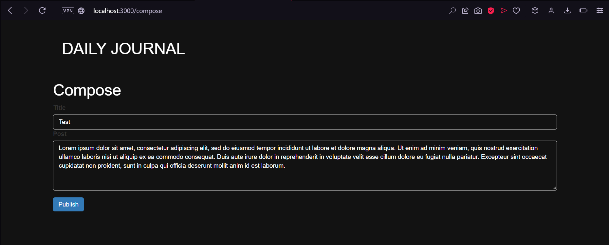

# Journal-Diary-using-node.js
This is a personal journal/diary that I created using Node.js and MongoDB.  
Dark themed with a minimalistic design. 

  

  

  

Running the project guide:  
Install node.js from the Node.js website.  
Type the below command on your terminal to install nodemon.
```
sudo npm install -g nodemon
```  
Create a MongoDB Atlas account followed by a cluster and copy the connection string and replace the comment in app.js.  
Clone this repository and open a terminal in your local repository.  
Type the below command on the terminal.  
```
npm install
```  
```
nodemon app.js
```  
You will be able to see the website by typing localhost:3000 onto your browser.  

NOTE:  
The following project was made to be a personal journal as well as a learning experience to use MongoDB as a backend for me.  
This project can be further improved by adding a feature to edit the entries.  
